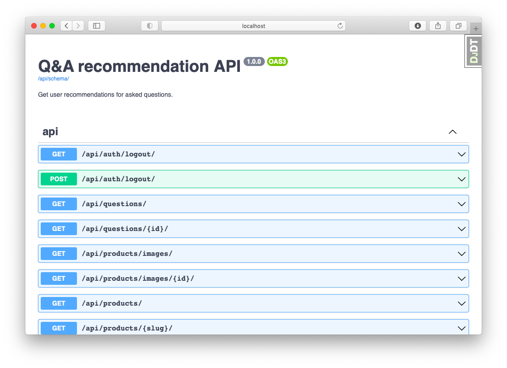

# RankRise

The goal of this website is to help users choose the best product in their case.

The technology goal is to design best-practice modern RESTful API with Django.



## Setup projects

When installing new pip package run the following commands inside `api` folder:

```shell
pipenv install package_name # adds to Pipfile

# Lock dependencies
# If prerelease error occurs add --pre flag
pipenv lock --pre # generates Pipfile.lock

# Lock dependencies in requirements.txt format (includes both prerelease and development packages)
pipenv lock --pre --dev --requirements > requirements.txt

# Option 1: Enter Django container shell
docker-compose -f docker-compose.dev.yml exec api pip install -r requirements.txt

# Option 2: Rebuild containers
docker-compose -f docker-compose.dev.yml down
docker-compose -f docker-compose.dev.yml up --build -d
```

## Description

**Idea**:

- Q/A website (question answer/solution/option/recommendation)

- Voting platform

- Recommendation platform

- Ranking platform

- Suggesting platform

- Comparison website

- Alternative searching platform

- Product rating platform

- Community centered

**Features**:

- User has username, email and avatar + social auth?

- Ask questions

- Answers as products (services)

- Product/service search/suggesting

- Question tags/categories (categorization)

- Multilayer categories (MPTT)

- Pros/Cons answer rating

- Pros/Cons commenting

- Answer name, website link, images, videos (links)

- Answer rank (rating) calculation/_algorithm_

- Questing/answer search

- API request throttling

- API testing & documenting

- Reporting feature (report questions/products/answers/comments)

- Question/product throttling/ban

- Follow question options/last update

- Question comments

- Question sharing/linking

- Option score calculation

- Product community specs (+proc/con comments)

- Product price (free, paid, open-source)

- Recommendation community agreement

- Vote against question, product, option, argument, etc.

**Similar websites**:

- Twitter, Reddit

- Quora, StackOverflow

- Slant, ProductHunt

- Alternative.to

**Plan**:

- Project development setup

- Authentication/Authorization

- Documentation

- Automated testing + test coverage

- CRUD components API

- Model

- Serializer

- API view/view set

- Manual testing

- Automated testing

**Technology stack** (technologies involved in the project):

- Python, Django, Django REST Framework, PostgreSQL

- dj_rest_auth, pytest/coverage, Swagger, django_dotenv

- black, pylint, isort, rope

- AWS/Heroku, Docker, Compose, Github, CI/CD

**Technological features**:

- OpenAPI, Swagger

- JWT authentication

- Test driven development

- Pagination

- Database search

Nice to have:

- Throttling

- Caching

- Versioning

- Container debugging

- MPTT structure management

## Roadmap

- [x] Dockerize project + PostgreSQL (setup dev environment)

- [x] Migrate + custom user model

- [x] Move from session to JWT authentication

- [x] Authentication endpoints

- [x] API documentation generation

- [x] Automated testing

- [x] Question

- [x] Test-driven development

- [x] Product

- [x] Filtering

- [x] Option

- [x] Voting

- [x] Ranking

- [x] Throttling

- [x] Import product dataset

- [x] Categorization

- [x] Caching

- [x] Debugging

- [x] S3 storage

- [x] Cloud deployment

- [x] Reporting

- [ ] Argument

- [ ] Single-page Application

**Single-page app**:

- [x] create-react-app

- [x] modern development setup (formatter, linter, etc.)

- [ ] design complexity-based file/code/project/directory structure and organization

- [ ] design API client (resources)

- [ ] design website frontend (colors, font, header, footer, etc.)

- [ ] basic authentication (signup, login, email) (functional + design style)

- [ ] crud/app pages (func + style)

## Question

Questions are the core of API.

API:

- Users (authenticated) can only ask questions. There should be some kind of throttling to prevent users from spamming a lot of questions.

- Any one can only list and retrieve questions.

- Only admins can delete or update questions (maybe based on reports).

API:

- list, retrieve - unauthenticated users

- create - authenticated users

- update, destroy - authenticated staff users

Models:

- Questions aren't bind to any user (not owned). A question is just a small text around 100 characters which has some (category) and ask_time. Question should be looked up by primary key (integer id or character slug).

## Product

Product represent some product or service that can be recommended as an option to specific question. Usually it is online/software or Internet service/product.

- id

- name (title, help text: you can not change name after)

- slug (automatically based on name)

- description

- images (links or _filesystem storage_: Django package)

- product website link

- price/cost (_choices_ from: open source, free, paid)

Validation/Model:

- id is a auto incrementing primary key (model)

- name and slug must be unique

- price should contain values only from choices

- website link must be valid URL

- description can be blank

- slug (URI) must not update after name update

- name and slug can not be changed in serializer/API

- name can not be blank

- description, website can be blank

- price default set to free (model)

- name must be <= 50 characters

- images must have image media type

URLs:

- Products should be available under /products/ URL

Serialization:

- Products should include images objects

API permissions:

- retrieve, list: unauthenticated

- create: authenticated

- delete: staff

### Product image

Image of the product, has the have API permissions as product.

Model:

- image field

  - 300x200

  - JPEG

  - 80% source quality

Permissions:

- Same as models

URL:

- Image will be available under /products/images/ (validate product slug != images)

## Filtering

API should also provide ability to make filtered queries:

- filter by equal, greater, etc.

- search query

- ordering of the result

- pagination of large amount of data

**Question**:

- search by question title (case insensitive partial match)

- order by latest/oldest ask time (default=latest)

- paginate questions by 20

**Product**:

- search word contains in product name

- full-text search by product description

- filter products by price

- paginate by 10

## Options

Community can suggests options which are products recommended to specific question.

Model:

- option connects together question and product (answer to question).

Permissions:

- options follow the same community rules, you can only get and create them.

- admins can delete suggested options if they are not appropriate.

Relations:

- If question is deleted, option should be deleted also (options).

- If product is deleted, option FK to product should be set to NULL (recommendations).

Routers (URL design):

- Options will be nested up on question or product (`/questions/<question_id>/options/<option_id>/`)

Requirements:

- Pagination by 10. Ordering by rank (descending).

- Question and product foreign keys should be unique together.

## Recommendation

Voting about suggested options is in the core of recommendation system.

Design:

- recommend or not recommend this option (upvote or downvote)

- write Pro/Con argument about option usage, share opinion

- like (upvote/downvote) top arguments

- comment on argument comments

- options will be ranked based on user votes and arguments

**Vote**:

- Vote should connect option and user (+ vote time)

- Vote option and user data are write-only

- Users can only once vote against specific option (unique together)

- Vote can be either up or down (and can be switched after)

- If option is deleted all votes should be too, if user is deleted all votes should stay (and set user to NULL)

- Votes will be available under `*/options/<option_id>/` route

  - Because `<option_id>` auto increment is absolute, it is not required to pass `<question_id>` in the `reverse(url_name)`

  - `<question_id>` from URI is required and still used for additional validation.

- Vote displaying should be anonymous (not voter information returned) only vote rate information (up/down) (_write-only_).

- Unauthenticated users can read/list, authenticated can also create votes, update and delete _their_ votes. Admins can do anything.

- Option should have convenient calculate fields (attributes: properties/methods.) or manager to get upvotes or downvotes count.

- Filter option votes based on up or down status (rate). Like `?up=True` or `?up=False`

- No API pagination for votes, ordering by latest vote time, filtering by up/down.

- Vote user should be determined automatically based on request session user.

  - vote user must be set to `request.user`

  - vote create API shouldn't display `user` in OpenAPI documentation (or note that it is get from request session)

- `option` and `user` API arguments will be determined from _URL_ option and _session_ user (arguments in body will be ignored).

## Ranking

Ranking system is used to sort options from best scored to less ones.

Ranking dependes on votes (upvotes, downvotes), arugments (count, pros, cons), comments.

Ranking data math will be based on on:

- JavaScript (client)

- Python (server)

- **SQL/ORM query** (database)

- UPDATE row (database)

Features:

- Query upvotes and downvotes of option should be available as option properties.

  - filter and count votes

- Upvotes and downvotes should be included in serializer as read-only fields.

- Upvotes and downvotes should be in rendered JSON data

- Rating is only used to order objects

- Rank is displayed in the data

### Algorithm

Rating:

$$
rating = upvotes - (downvotes * \frac{3}{4})
$$

Rank point:

$$
point = \frac{max(rating)}{100}
$$

Rank:

$$
rank = \frac{rating}{point}-\frac{downvotes}{upvotes}*10
$$

1. Calculate rating for each option? To find the MAX(rating) (SQL/ORM).
2. Calculate score per 1 point (Python).
3. Annotate each ordered option with the rank, display annotated rank (Python/SQL/ORM).

## Throttling

This API is not very restrictive and built on top community trust and fairness. It has less restrictive throttling permissions to prevent high request rate (to save database and server from overloading).

Community throttling:

- forbid making more than 100 create (POST) requests in a day (authenticated users) and more than 5 POST requests in minute.

  - create views of questions, product (images), options APIs.

  - burst: 5 req/min

  - sustained: 100 req/day

- no throttling for admin users (admins are not restricted to throttling).

Tests:

- in order to test sustainable request rate tests should mock burst rate to be the same as sustainable.

## Categories

Categories are content management technique for organizing products. For this API products (and questions) will be categorized hierarchically using MPTT in PostgreSQL.

Model:

- Category (subcategory) has id, name and reference to the parent category (to provide tree categorization).

- slug?

- when parent category is deleted all it's children should also be deleted.

Validation (serializer level):

- Category name can not contain numbers (model level validation, admin interface).

- All model fields are read-only (only accessable from admin interface).

  - **Because everything is read-only - no validation is required** (or validation tests)

Product:

- Category is referenced from product model, on delete - `set null` product, related name (category products) - `products`.

Application Interface:

- Categories should be created, updated and deleted from admin interface.

- Categories can only be listed or retrieved (readonly) using API (`/categories/<id:int>/`) - **read-only API**.

- Categories can be search by name (through all categories), filtered by parent (get children) and paginated by 20, ordering by name.

- API should be hierarchical, meaning have multiple levels. _First should be root categories_, then under this category children can be accessed like `/categories/1/children/2/children/3/`. Or get children just by filtering parent like `/categories/?parent=1` to get children of 1 category.

- To get category product filtering product by category should be used like `/products?category=1`.

## Caching

Caching will be used to save _expensive rating/ranking_ queries and calculations when requesting option list.

- level: per-view

- cache backend: Redis (in-memory)

## Debugging

I need to debug Django running (`./manage.py runserver`) inside Docker container from VSCode. I will use `pydebug` PyPA package from Microsoft.

## Storage

> Static files (image) are files that aren't changed/updated/modified (database).

Amazon S3 will be used as a filesystem storage service. The following will be stored:

- Content delivery network - static files (CSS, JS, JPEG, PNG)

- User uploads - static upload files (JPEG, PNG)

## Reports

To prevent inappropriate/bad questions, production, answers and comments the reporting system
will be developed.

- users sent reports about the objects
- admins review report and decide to do something with that

Report contains:

- title
- description
- resource/object type
- object pk/slug
- created
- id
- reporter (user or admin)

> If object gets destroyed, all reports should be also

Users can only create reports with following fields:

- title
- description
- resource/content type
- object slug

For admins all fields will be visible + actions:

- create (admins saw themselfs)
- list
- retrieve
- destroy (inappropriate report)

No filters, search nor ordering => enough.

Slug vs id:

- question - id
- production - slug
- option - id
- comment - id
- report - uuid
